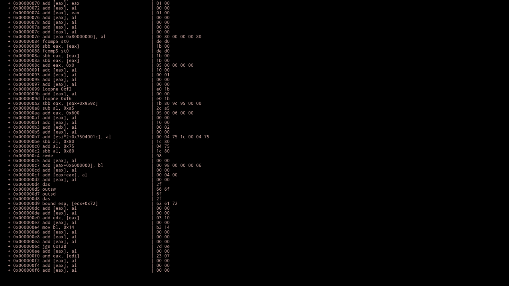

License-Breaker
===============

Screensaver that outputs the disassembly of the kernel.

This screensaver requires udis86, which limits it to only x86 systems; x86_64 is not supported.

Screenshot
----------

